# PROJECT_ARCHITECTURE.md

> Brandcora (Brand Guard) — SaaS brand compliance platform
> Auto-generated architecture documentation

---

## Table of Contents

1. [Tech Stack](#1-tech-stack)
2. [Folder Structure](#2-folder-structure)
3. [Monorepo & Dependency Graph](#3-monorepo--dependency-graph)
4. [Frontend Architecture](#4-frontend-architecture)
5. [Backend Architecture](#5-backend-architecture)
6. [Authentication Flow](#6-authentication-flow)
7. [OAuth Flow](#7-oauth-flow)
8. [Stripe Payment Flow](#8-stripe-payment-flow)
9. [Brand Extraction Flow](#9-brand-extraction-flow)
10. [Scan Engine](#10-scan-engine)
11. [Database Schema](#11-database-schema)
12. [API Routes](#12-api-routes)
13. [Environment Variables](#13-environment-variables)
14. [Third-Party Services](#14-third-party-services)
15. [Deployment Architecture](#15-deployment-architecture)
16. [Mermaid Diagrams](#16-mermaid-diagrams)

---

## 1. Tech Stack

| Layer | Technology |
|-------|-----------|
| **Monorepo** | pnpm workspaces (v9.15.4) |
| **Frontend** | Next.js 14 (App Router), React 18, TypeScript |
| **UI** | shadcn/ui (radix-maia style), Tailwind CSS, Phosphor Icons |
| **Backend** | Express 4, Node.js 20, TypeScript (ESM) |
| **Auth** | Better Auth (Prisma adapter, email/password + Google/GitHub/Apple OAuth) |
| **Database** | PostgreSQL (Neon serverless), Prisma ORM |
| **Payments** | Stripe (Checkout, Customer Portal, Webhooks) |
| **Image Processing** | Sharp (social media scan analysis) |
| **File Uploads** | Multer |
| **Validation** | Zod |
| **Testing** | Vitest |
| **CI/CD** | GitHub Actions, Vercel (frontend), Render (backend) |
| **Fonts** | Manrope (sans), IBM Plex Mono (mono) |

---

## 2. Folder Structure

```
saas-foundation/
├── .agents/skills/ui-ux-pro-max/       # AI agent skill config
├── .github/workflows/ci.yml            # CI pipeline (Node 20/22)
├── .firecrawl/                          # Web scraping reference data
├── apps/
│   ├── web/                             # Next.js 14 frontend (@saas/web)
│   │   ├── app/                         # App Router pages
│   │   │   ├── layout.tsx              # Root layout
│   │   │   ├── page.tsx               # Landing page (874 lines)
│   │   │   ├── providers.tsx          # AuthProvider wrapper
│   │   │   ├── login/page.tsx         # Login
│   │   │   ├── register/page.tsx      # Registration
│   │   │   ├── forgot-password/       # Forgot password
│   │   │   ├── reset-password/        # Reset password
│   │   │   ├── email-verified/        # Email verification
│   │   │   ├── auth/complete/         # OAuth callback handler
│   │   │   ├── pricing/               # Pricing page
│   │   │   ├── checkout/              # Success/cancel pages
│   │   │   ├── (dashboard)/           # Protected dashboard route group
│   │   │   │   ├── layout.tsx         # Sidebar nav layout
│   │   │   │   ├── dashboard/         # Main dashboard
│   │   │   │   ├── brand/             # Brand profile + extraction
│   │   │   │   ├── scans/             # Reports list
│   │   │   │   ├── billing/           # Subscription management
│   │   │   │   └── settings/          # 7-section settings
│   │   │   └── settings/              # Public settings routes
│   │   ├── src/lib/                    # Utilities & auth
│   │   │   ├── auth-client.ts         # better-auth React client
│   │   │   ├── auth-context.tsx       # AuthProvider + useAuth
│   │   │   ├── api.ts                 # apiFetch helper
│   │   │   ├── brand-identity.ts      # Brand scoring engine (client)
│   │   │   ├── protected-route.tsx    # Auth guard HOC
│   │   │   └── utils.ts              # cn() utility
│   │   ├── src/components/            # UI components
│   │   │   ├── ui/                    # shadcn/ui (9 components)
│   │   │   └── layout/header.tsx      # Landing page header
│   │   ├── next.config.js             # API proxy rewrites
│   │   ├── tailwind.config.ts         # Theme, fonts, animations
│   │   └── components.json            # shadcn/ui config
│   │
│   └── api/                            # Express backend (@saas/api)
│       ├── src/
│       │   ├── index.ts               # Express entry (97 lines)
│       │   ├── preload.ts             # dotenv loader
│       │   ├── lib/auth.ts            # Better Auth server config
│       │   ├── middleware/
│       │   │   ├── require-auth.ts    # Session validation
│       │   │   ├── require-workspace.ts # RBAC (member/admin/owner)
│       │   │   ├── request-logger.ts  # Request logging
│       │   │   └── error-handler.ts   # Global error handler
│       │   ├── modules/               # 16 feature modules
│       │   │   ├── auth/              # Auth routes
│       │   │   ├── users/             # User management
│       │   │   ├── workspaces/        # Workspace CRUD
│       │   │   ├── memberships/       # Role management
│       │   │   ├── invitations/       # Team invitations
│       │   │   ├── billing/           # Stripe checkout/portal
│       │   │   ├── subscriptions/     # Subscription mgmt
│       │   │   ├── webhooks/          # Stripe webhooks
│       │   │   ├── audit/             # Audit logs
│       │   │   ├── brand-profile/     # Brand profile CRUD
│       │   │   ├── uploads/           # File uploads (multer)
│       │   │   ├── scans/             # Scan engine (689+ lines)
│       │   │   │   ├── service.ts
│       │   │   │   ├── routes.ts
│       │   │   │   ├── score-engine.ts
│       │   │   │   ├── social-checker.ts
│       │   │   │   ├── website-checker.ts
│       │   │   │   └── url-validator.ts
│       │   │   ├── dashboard/         # Dashboard aggregation
│       │   │   ├── usage/             # Usage metering
│       │   │   ├── brand-extract/     # URL brand extraction
│       │   │   │   ├── routes.ts      # 583 lines
│       │   │   │   └── gradient-parser.ts # 993 lines
│       │   │   └── entitlements/      # Plan feature checks
│       │   └── types/css-tree.d.ts
│       ├── Dockerfile                  # Multi-stage Docker build
│       ├── start.sh                    # Startup script
│       └── dist/                       # Compiled output
│
├── packages/
│   ├── config/                         # @saas/config — Zod env validation
│   │   └── src/env.ts                 # All env vars typed
│   ├── database/                       # @saas/database — Prisma client
│   │   ├── src/index.ts               # Singleton PrismaClient
│   │   └── prisma/schema.prisma       # 23 models (426 lines)
│   ├── shared/                         # @saas/shared — Types, schemas, constants
│   │   └── src/
│   │       ├── types.ts               # Domain types (259 lines)
│   │       ├── schemas.ts             # Zod validation schemas
│   │       └── constants.ts           # Plans, limits, weights, platforms
│   └── ui/                             # @saas/ui — Legacy UI components
│       └── src/components/             # Button, Card, Input, etc.
│
├── docs/                               # Setup documentation
│   ├── BETTER_AUTH_SETUP.md
│   ├── NEON_SETUP.md
│   ├── STRIPE_SETUP.md
│   ├── ADDING_PRODUCT_FEATURES.md
│   ├── ADDING_PRODUCT_MODELS.md
│   └── ADDING_PRODUCT_SEEDS.md
│
├── vercel.json                         # Vercel deployment config
├── render.yaml                         # Render deployment config
├── .github/workflows/ci.yml            # CI pipeline
├── pnpm-workspace.yaml                 # Workspace definition
├── package.json                        # Root scripts & husky
└── .env.example                        # Environment template
```

---

## 3. Monorepo & Dependency Graph

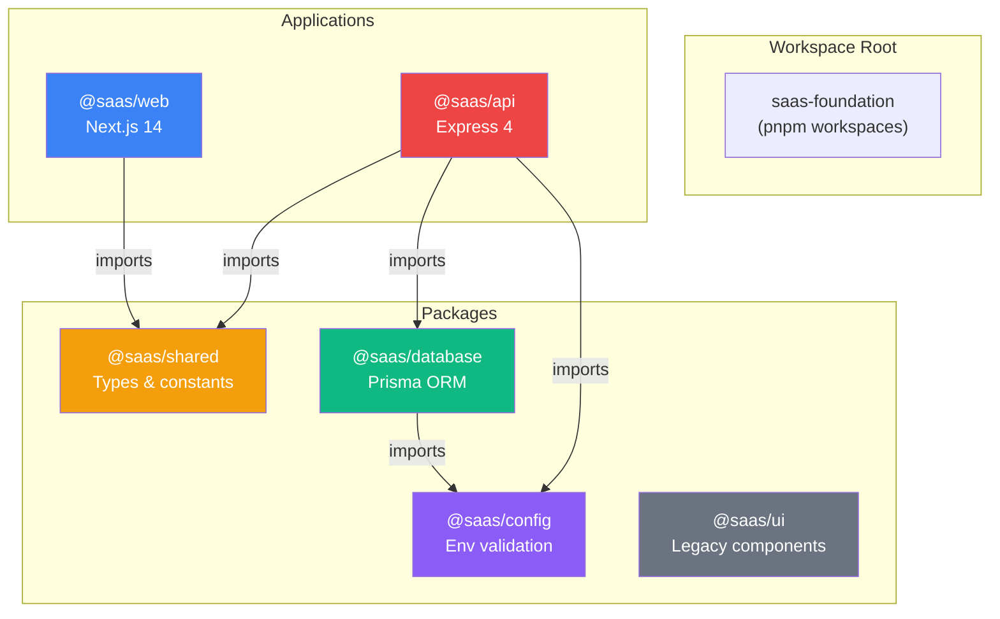

---

## 4. Frontend Architecture

### 4.1 Routing Structure

| Route | Auth | Description |
|-------|------|-------------|
| `/` | Public | Landing page with brand extraction CTA |
| `/login` | Public | Email/password + Google OAuth |
| `/register` | Public | Account creation |
| `/forgot-password` | Public | Password reset request |
| `/reset-password` | Public | Password reset form |
| `/email-verified` | Public | Email verification confirmation |
| `/auth/complete` | Public | OAuth callback handler |
| `/pricing` | Public | Standalone pricing page |
| `/checkout/success` | Public | Checkout success |
| `/checkout/cancelled` | Public | Checkout cancellation |
| `/(dashboard)/dashboard` | Protected | Main dashboard |
| `/(dashboard)/brand` | Protected | Brand profile viewer/editor |
| `/(dashboard)/brand/extract` | Protected | Brand extraction from URL |
| `/(dashboard)/scans` | Protected | Reports list (social/website) |
| `/(dashboard)/scans/:scanId` | Protected | Individual scan report |
| `/(dashboard)/billing` | Protected | Subscription management |
| `/(dashboard)/settings` | Protected | Settings (7 sections) |

### 4.2 Component Architecture

```
app/
├── layout.tsx                          # <Providers> wrapper
├── providers.tsx                       # AuthProvider (auth-context)
├── (dashboard)/layout.tsx              # <ProtectedRoute> + sidebar nav
│   └── Sidebar: Brand Profile | Reports | Settings
└── (dashboard)/settings/layout.tsx     # Nested settings sidebar
    └── 7 sections: Profile, Security, Billing, Workspace, Team, Notifications, Legal
```

### 4.3 Client-Side Data Flow

- **Brand Extraction:** URL → `POST /api/v1/brand-extract` → localStorage(`brand-profile-data`) → redirect to `/brand`
- **Brand Profile:** Read localStorage → normalize → display/edit → save back
- **Scans:** localStorage (`scan-*` keys) → list/filter/display
- **Billing:** API fetch `/api/v1/billing/subscription` → display
- **Auth:** Cookie-based (`credentials: 'include'`) → `useSession()` → `ProtectedRoute` guard

### 4.4 API Proxy Pattern

`apps/web/next.config.js` rewrites all `/api/:path*` to `${API_URL}/api/:path*` (default: `http://localhost:10000`), so the frontend never calls the backend directly.

---

## 5. Backend Architecture

### 5.1 Express Server Structure

```
apps/api/src/
├── index.ts              # Express app setup, middleware, route mounting
├── preload.ts            # dotenv config
├── lib/auth.ts           # Better Auth config (Prisma adapter)
├── middleware/            # 4 middleware files
│   ├── require-auth.ts   # Session → userId injection
│   ├── require-workspace.ts # RBAC (member/admin/owner)
│   ├── request-logger.ts # HTTP logging
│   └── error-handler.ts  # Global error handling
└── modules/              # 16 feature modules (each with routes.ts)
```

### 5.2 Middleware Stack (in order)

1. `helmet` — Security headers
2. `cors` — Cross-origin (WEB_APP_URL + Vercel previews)
3. `request-logger` — HTTP method, URL, status, duration
4. `express.json` — Body parsing (except `/api/auth/*`)
5. `express.static('uploads')` — Static file serving
6. **Better Auth handler** — `app.all('/api/auth/*', toNodeHandler(auth))` — mounted BEFORE body parser
7. **Route modules** — All `/api/v1/*` routes
8. **Error handler** — Global catch-all

### 5.3 Module Pattern

Each module follows a consistent pattern:
```
modules/<name>/
├── routes.ts        # Express Router with HTTP methods + handlers
├── service.ts       # Business logic (optional)
└── __tests__/       # Tests (optional)
```

---

## 6. Authentication Flow

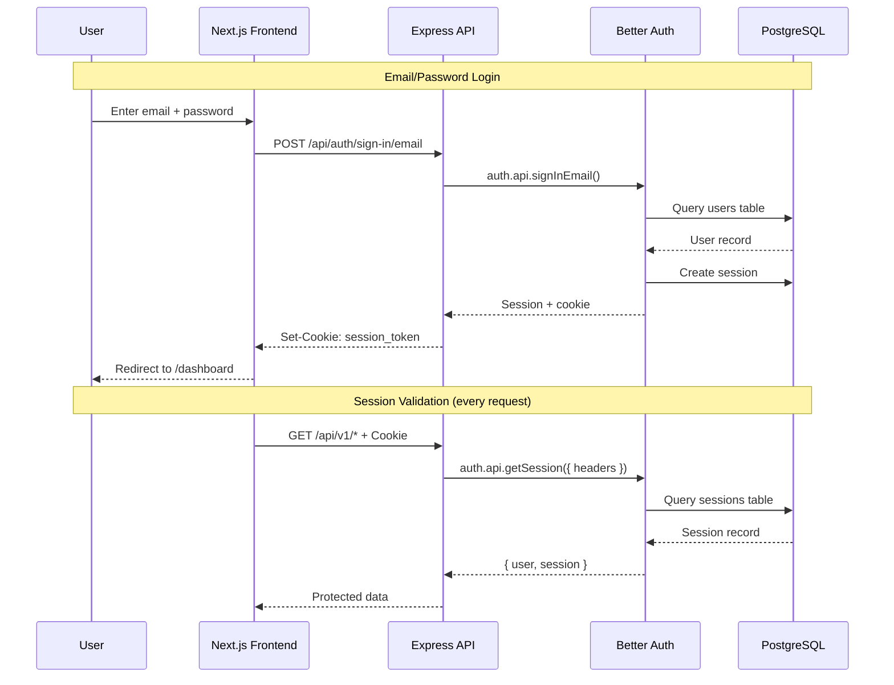

### 6.1 Session Configuration

| Setting | Value |
|---------|-------|
| Expiry | 7 days |
| Update Age | 24 hours (refresh interval) |
| Cookie Cache | Enabled (7-day max age) |
| SameSite | `lax` |
| Secure | `true` in production |
| HttpOnly | `true` |
| Account Linking | Enabled |

### 6.2 Auth Endpoints

| Method | Path | Purpose |
|--------|------|---------|
| `POST` | `/api/auth/sign-up/email` | Register new account |
| `POST` | `/api/auth/sign-in/email` | Login with email/password |
| `POST` | `/api/auth/sign-out` | Destroy session |
| `POST` | `/api/auth/forgot-password` | Request password reset |
| `POST` | `/api/auth/reset-password` | Reset password with token |
| `GET` | `/api/auth/session` | Get current session |
| `GET` | `/api/auth/verify-email` | Verify email token |

### 6.3 Admin Bypass (Development)

A client-side-only shortcut exists in `auth-context.tsx`:
- Email: `admin123@admin.com`, Password: `admin`
- Bypasses server auth entirely (no session created)
- Allows navigating the UI without a real backend user
- API calls will fail with 401 (no valid session)

---

## 7. OAuth Flow

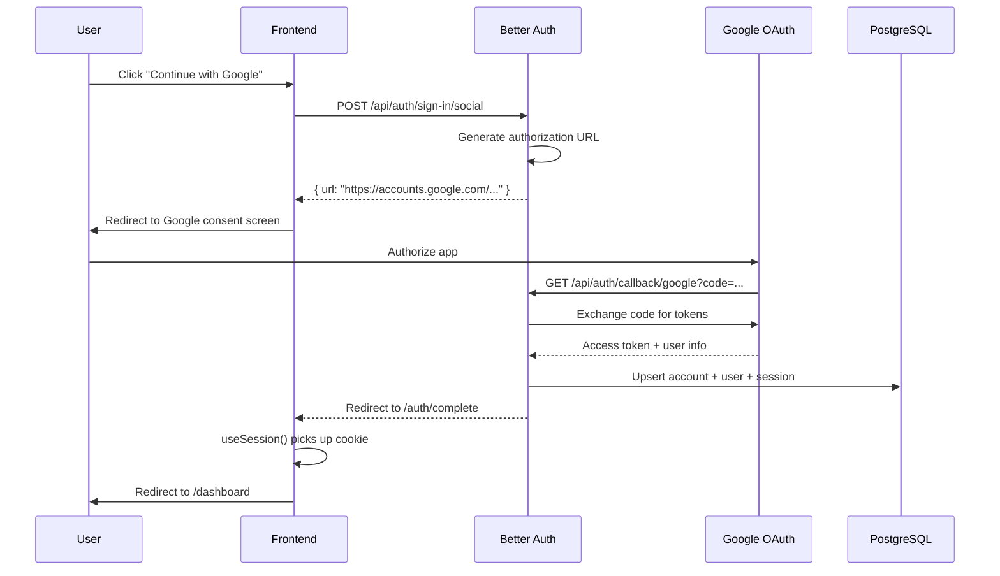

### 7.1 OAuth Providers

| Provider | Status | Config Required |
|----------|--------|----------------|
| **Google** | Always enabled | `GOOGLE_CLIENT_ID` + `GOOGLE_CLIENT_SECRET` |
| **GitHub** | Conditional | `GITHUB_CLIENT_ID` + `GITHUB_CLIENT_SECRET` (both required) |
| **Apple** | Conditional | `APPLE_CLIENT_ID` + `APPLE_CLIENT_SECRET` (both required) |

> Note: The UI only renders a Google button. GitHub/Apple are server-ready but not exposed in the frontend.

---

## 8. Stripe Payment Flow

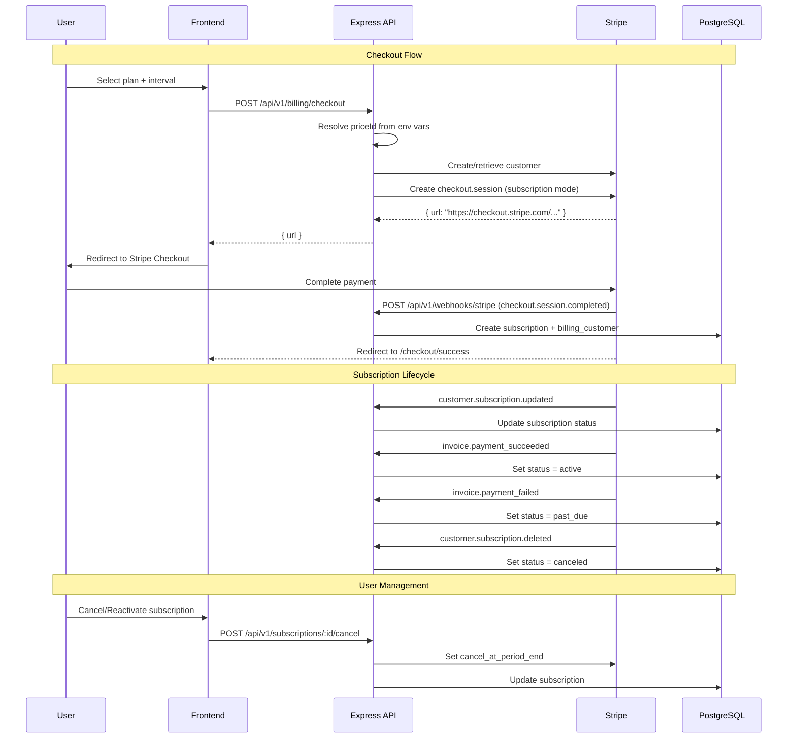

### 8.1 Plans & Limits

| Plan | Social Checks | Website Scans | Pages/Scan | Report History | Features |
|------|---------------|---------------|------------|----------------|----------|
| **Free** | 3 | 1 | 1 | 7 days | None |
| **Brand Guard Lite** | 50 | 5 | 5 | 30 days | Reports, recommendations |
| **Starter** | 50 | 5 | 5 | 30 days | Reports, recommendations |
| **Pro** | 500 | 50 | 10 | 90 days | Full features |
| **Business** | Unlimited | Unlimited | 20 | 365 days | Full features |

### 8.2 Webhook Event Processing

| Stripe Event | Action |
|-------------|--------|
| `checkout.session.completed` | Create subscription + billing customer |
| `customer.subscription.created/updated` | Sync subscription state |
| `customer.subscription.deleted` | Mark as canceled |
| `invoice.payment_succeeded` | Set status = active |
| `invoice.payment_failed` | Set status = past_due |

### 8.3 Stripe Webhook Security

- Signature verification via `stripe.webhooks.constructEvent(rawBody, sig, secret)`
- Idempotent processing via `webhookEvent` table (provider + externalEventId unique key)
- Already-processed events return 200 immediately

---

## 9. Brand Extraction Flow

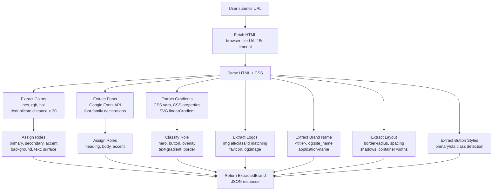

### 9.1 Extraction Capabilities

| Asset | Method | Output |
|-------|--------|--------|
| **Colors** | CSS parsing (hex, rgb, hsl), Euclidean deduplication | Top 12 with roles + confidence |
| **Fonts** | Google Fonts API, font-family CSS | Up to 6 with roles |
| **Logos** | `` matching, favicon, og:image | URLs with confidence |
| **Gradients** | CSS vars, CSS properties, SVG elements | Full gradient specs with similarity |
| **Brand Name** | `<title>`, `og:site_name`, hostname | String |
| **Border Radius** | CSS `border-radius` values | Median value |
| **Spacing** | margin/padding/gap values | Sorted deduped list |
| **Shadows** | `box-shadow` values | Up to 4 values |
| **Button Styles** | Button element class detection | Primary/secondary styles |

### 9.2 Gradient Parser (`gradient-parser.ts` — 993 lines)

Supports:
- All CSS gradient types (linear, radial, conic)
- Color formats: hex, rgb, hsl, named CSS colors (148 names), transparent
- Direction normalization (degrees, radians, turns, named directions)
- CSS variable resolution (up to 5 nesting levels)
- SVG gradient extraction
- Gradient deduplication and similarity scoring (color 45%, position 20%, direction 15%)
- Role classification from CSS context

---

## 10. Scan Engine

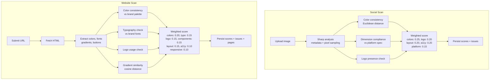

### 10.1 Website Checks (8 categories)

| Check | Weight | Method |
|-------|--------|--------|
| Color Consistency | 0.20 | Euclidean RGB distance vs brand palette |
| Typography | 0.15 | Font-family matching |
| Logo Usage | 0.15 | Logo reference detection |
| Components | 0.15 | Button analysis |
| Gradients | 0.15 | Similarity scoring (color, position, angle) |
| Layout | 0.15 | Nav/footer detection |
| Accessibility | 0.10 | Manual review reminder |
| Responsiveness | 0.10 | Manual testing recommendation |

### 10.2 Social Checks (5 categories)

| Check | Weight | Method |
|-------|--------|--------|
| Color Consistency | 0.25 | Pixel sampling + brand comparison |
| Logo Presence | 0.20 | Logo detection |
| Layout | 0.20 | Dimension check |
| Accessibility | 0.20 | Manual review |
| Platform Readiness | 0.15 | Dimension vs platform spec |

### 10.3 Supported Platforms

| Platform | Dimensions |
|----------|-----------|
| Instagram Post | 1080x1080 |
| Instagram Story | 1080x1920 |
| LinkedIn Post | 1200x627 |
| LinkedIn Banner | 1584x396 |
| Facebook Post | 1200x630 |
| YouTube Thumbnail | 1280x720 |
| Advertisement | 1080x1080 |
| General | 1080x1080 |

---

## 11. Database Schema

```mermaid
erDiagram
    user ||--o{ session : has
    user ||--o{ account : has
    user ||--o| profile : has
    user ||--o{ membership : "belongs to"
    user ||--o{ invitation : "sends"
    user ||--o{ auditLog : "generates"
    user ||--o| billingCustomer : "linked to"
    user ||--o{ scan : "creates"

    workspace ||--o{ membership : has
    workspace ||--o{ invitation : has
    workspace ||--o| brandProfile : has
    workspace ||--o{ scan : has
    workspace ||--o{ usageRecord : has

    brandProfile ||--o{ brandColor : has
    brandProfile ||--o{ brandFont : has
    brandProfile ||--o{ brandLogo : has
    brandProfile ||--o{ brandGradient : has
    brandProfile ||--o{ brandRule : has

    scan ||--o{ scanScore : has
    scan ||--o{ scanIssue : has
    scan ||--o{ scanPage : has

    user {
        cuid id PK
        string email UK
        string name
        boolean emailVerified
        string image
        datetime createdAt
        datetime updatedAt
    }

    session {
        cuid id PK
        string token UK
        datetime expiresAt
        string ipAddress
        string userAgent
        cuid userId FK
        datetime createdAt
        datetime updatedAt
    }

    account {
        cuid id PK
        string accountId
        string providerId
        string accessToken
        string refreshToken
        string idToken
        datetime accessTokenExpiresAt
        datetime refreshTokenExpiresAt
        string scope
        string password
        cuid userId FK
    }

    verification {
        cuid id PK
        string identifier
        string value
        datetime expiresAt
        datetime createdAt
        datetime updatedAt
    }

    profile {
        cuid id PK
        string displayName
        string avatarUrl
        boolean onboardingCompleted
        cuid userId FK
    }

    workspace {
        cuid id PK
        string name
        string slug
        cuid ownerId FK
        datetime createdAt
        datetime updatedAt
    }

    membership {
        cuid id PK
        string role
        cuid userId FK
        cuid workspaceId FK
        datetime createdAt
        datetime updatedAt
    }

    invitation {
        cuid id PK
        string email
        string token UK
        string role
        string status
        datetime expiresAt
        cuid workspaceId FK
        cuid invitedById FK
        datetime createdAt
        datetime updatedAt
    }

    billingCustomer {
        cuid id PK
        string stripeCustomerId UK
        cuid userId FK
        datetime createdAt
        datetime updatedAt
    }

    subscription {
        cuid id PK
        string stripeSubscriptionId UK
        string stripePriceId
        string planKey
        string status
        string billingInterval
        datetime currentPeriodStart
        datetime currentPeriodEnd
        boolean cancelAtPeriodEnd
        cuid workspaceId FK
        cuid billingCustomerId FK
        datetime createdAt
        datetime updatedAt
    }

    webhookEvent {
        cuid id PK
        string provider
        string externalEventId
        json payload
        string status
        datetime createdAt
    }

    auditLog {
        cuid id PK
        string action
        string resourceType
        string resourceId
        json metadata
        cuid userId FK
        cuid workspaceId FK
        datetime createdAt
    }

    brandProfile {
        cuid id PK
        string name
        string description
        string websiteUrl
        string headingFont
        string bodyFont
        int buttonRadius
        int borderRadius
        json spacing
        json buttonStyles
        cuid workspaceId FK
        datetime createdAt
        datetime updatedAt
    }

    brandColor {
        cuid id PK
        string name
        string hex
        string role
        float confidence
        cuid brandProfileId FK
    }

    brandFont {
        cuid id PK
        string family
        string weight
        string url
        string role
        float confidence
        cuid brandProfileId FK
    }

    brandLogo {
        cuid id PK
        string url
        string storageKey
        string type
        int width
        int height
        float confidence
        cuid brandProfileId FK
    }

    brandGradient {
        cuid id PK
        string type
        json stops
        float angle
        string shape
        string position
        string role
        float confidence
        string normalizedValue
        string cssVariable
        cuid brandProfileId FK
    }

    brandRule {
        cuid id PK
        string category
        string name
        string value
        cuid brandProfileId FK
    }

    scan {
        cuid id PK
        string type
        string status
        string sourceUrl
        float overallScore
        cuid brandProfileId FK
        cuid workspaceId FK
        cuid userId FK
        datetime createdAt
        datetime updatedAt
    }

    scanScore {
        cuid id PK
        string category
        float score
        float weight
        cuid scanId FK
    }

    scanIssue {
        cuid id PK
        string severity
        string category
        string title
        string description
        string recommendation
        cuid scanId FK
    }

    scanPage {
        cuid id PK
        string url
        int pageNumber
        float score
        string screenshotUrl
        json extractedData
        cuid scanId FK
    }

    usageRecord {
        cuid id PK
        string type
        int quantity
        datetime billingPeriodStart
        datetime billingPeriodEnd
        cuid workspaceId FK
        cuid userId FK
        datetime createdAt
    }
```

---

## 12. API Routes

### 12.1 Complete Route Map

| Method | Path | Module | Auth | Description |
|--------|------|--------|------|-------------|
| `GET` | `/health` | — | No | Health check |
| `ALL` | `/api/auth/*` | Better Auth | No | Auth catch-all |
| `POST` | `/api/v1/auth/sign-up/email` | Auth | No | Register |
| `POST` | `/api/v1/auth/sign-in/email` | Auth | No | Login |
| `POST` | `/api/v1/auth/sign-out` | Auth | No | Logout |
| `POST` | `/api/v1/auth/forgot-password` | Auth | No | Request reset |
| `POST` | `/api/v1/auth/reset-password` | Auth | No | Reset password |
| `GET` | `/api/v1/auth/session` | Auth | No | Get session |
| `GET` | `/api/v1/auth/verify-email` | Auth | No | Verify email |
| `GET` | `/api/v1/users/me` | Users | Yes | Get current user |
| `PATCH` | `/api/v1/users/me` | Users | Yes | Update profile |
| `GET` | `/api/v1/users/me/memberships` | Users | Yes | Get memberships |
| `DELETE` | `/api/v1/users/me` | Users | Yes | Delete account |
| `POST` | `/api/v1/workspaces` | Workspaces | Yes | Create workspace |
| `GET` | `/api/v1/workspaces/:id` | Workspaces | Yes+Member | Get workspace |
| `PATCH` | `/api/v1/workspaces/:id` | Workspaces | Yes+Admin | Update workspace |
| `DELETE` | `/api/v1/workspaces/:id` | Workspaces | Yes+Owner | Delete workspace |
| `GET` | `/api/v1/memberships/:wid/members` | Memberships | Yes+Admin | List members |
| `PATCH` | `/api/v1/memberships/:id/role` | Memberships | Yes | Change role |
| `DELETE` | `/api/v1/memberships/:id` | Memberships | Yes | Remove member |
| `POST` | `/api/v1/invitations/:wid` | Invitations | Yes+Admin | Send invite |
| `POST` | `/api/v1/invitations/accept` | Invitations | Yes | Accept invite |
| `GET` | `/api/v1/invitations/:wid` | Invitations | Yes+Admin | List invites |
| `DELETE` | `/api/v1/invitations/:id` | Invitations | Yes+Admin | Revoke invite |
| `POST` | `/api/v1/billing/checkout` | Billing | Yes | Create checkout |
| `GET` | `/api/v1/billing/portal` | Billing | Yes | Stripe portal |
| `GET` | `/api/v1/billing/subscription` | Billing | Yes | Get subscription |
| `GET` | `/api/v1/subscriptions/:wid` | Subscriptions | Yes | Get subscription |
| `POST` | `/api/v1/subscriptions/:wid/cancel` | Subscriptions | Yes | Cancel |
| `POST` | `/api/v1/subscriptions/:wid/reactivate` | Subscriptions | Yes | Reactivate |
| `POST` | `/api/v1/webhooks/stripe` | Webhooks | Stripe sig | Handle webhook |
| `GET` | `/api/v1/audit/:wid` | Audit | Yes | Audit logs |
| `GET` | `/api/v1/brand-profile` | Brand Profile | Yes | Get profile |
| `POST` | `/api/v1/brand-profile` | Brand Profile | Yes | Create profile |
| `PATCH` | `/api/v1/brand-profile` | Brand Profile | Yes | Update profile |
| `POST` | `/api/v1/brand-profile/colors` | Brand Profile | Yes | Add color |
| `DELETE` | `/api/v1/brand-profile/colors/:id` | Brand Profile | Yes | Remove color |
| `POST` | `/api/v1/brand-profile/fonts` | Brand Profile | Yes | Add font |
| `DELETE` | `/api/v1/brand-profile/fonts/:id` | Brand Profile | Yes | Remove font |
| `DELETE` | `/api/v1/brand-profile/logos/:id` | Brand Profile | Yes | Remove logo |
| `POST` | `/api/v1/brand-profile/rules` | Brand Profile | Yes | Add rule |
| `DELETE` | `/api/v1/brand-profile/rules/:id` | Brand Profile | Yes | Remove rule |
| `POST` | `/api/v1/brand-profile/gradients` | Brand Profile | Yes | Add gradient |
| `PATCH` | `/api/v1/brand-profile/gradients/:id` | Brand Profile | Yes | Update gradient |
| `DELETE` | `/api/v1/brand-profile/gradients/:id` | Brand Profile | Yes | Remove gradient |
| `POST` | `/api/v1/uploads/logo` | Uploads | Yes | Upload logo |
| `POST` | `/api/v1/uploads/social-design` | Uploads | Yes | Upload design |
| `POST` | `/api/v1/scans/social` | Scans | Yes | Create social scan |
| `POST` | `/api/v1/scans/website` | Scans | Yes | Create website scan |
| `GET` | `/api/v1/scans` | Scans | Yes | List scans |
| `GET` | `/api/v1/scans/:id` | Scans | Yes | Get scan |
| `DELETE` | `/api/v1/scans/:id` | Scans | Yes | Delete scan |
| `GET` | `/api/v1/dashboard` | Dashboard | Yes | Dashboard data |
| `GET` | `/api/v1/usage` | Usage | Yes | Usage stats |
| `POST` | `/api/v1/brand-extract` | Brand Extract | No | Extract from URL |

---

## 13. Environment Variables

### 13.1 Core

| Variable | Required | Default | Used In | Description |
|----------|----------|---------|---------|-------------|
| `NODE_ENV` | No | `development` | Everywhere | Environment mode |
| `PORT` | No | `3001` | API | Server port |
| `WEB_APP_URL` | No | `http://localhost:3000` | API, Frontend | Frontend URL (CORS, redirects) |
| `API_BASE_URL` | No | `http://localhost:3001` | API | Backend URL |

### 13.2 Database

| Variable | Required | Used In | Description |
|----------|----------|---------|-------------|
| `DATABASE_URL` | Yes | Database | Neon pooled PostgreSQL connection |
| `DIRECT_URL` | Yes | Database | Neon direct connection (migrations) |

### 13.3 Authentication

| Variable | Required | Used In | Description |
|----------|----------|---------|-------------|
| `BETTER_AUTH_SECRET` | Yes (min 32) | API | Token signing secret |
| `BETTER_AUTH_URL` | No | API | Better Auth base URL |
| `GOOGLE_CLIENT_ID` | Optional* | API | Google OAuth client ID |
| `GOOGLE_CLIENT_SECRET` | Optional* | API | Google OAuth client secret |
| `GITHUB_CLIENT_ID` | Optional | API | GitHub OAuth client ID |
| `GITHUB_CLIENT_SECRET` | Optional | API | GitHub OAuth client secret |
| `APPLE_CLIENT_ID` | Optional | API | Apple OAuth client ID |
| `APPLE_CLIENT_SECRET` | Optional | API | Apple OAuth client secret |

> *Google is always included in auth config (will crash if missing). GitHub/Apple are conditionally included.

### 13.4 Stripe

| Variable | Required | Used In | Description |
|----------|----------|---------|-------------|
| `STRIPE_SECRET_KEY` | Optional | API | Stripe API secret key |
| `STRIPE_WEBHOOK_SECRET` | Optional | API | Stripe webhook signing secret |
| `STRIPE_PRICE_ID_STARTER_MONTHLY` | Optional | API | Starter monthly price |
| `STRIPE_PRICE_ID_STARTER_YEARLY` | Optional | API | Starter yearly price |
| `STRIPE_PRICE_ID_PRO_MONTHLY` | Optional | API | Pro monthly price |
| `STRIPE_PRICE_ID_PRO_YEARLY` | Optional | API | Pro yearly price |
| `STRIPE_PRICE_ID_BUSINESS_MONTHLY` | Optional | API | Business monthly price |
| `STRIPE_PRICE_ID_BUSINESS_YEARLY` | Optional | API | Business yearly price |
| `STRIPE_PRICE_ID_BRAND_GUARD_LITE_MONTHLY` | Optional | API | Brand Guard Lite monthly |

---

## 14. Third-Party Services

| Service | Purpose | Integration |
|---------|---------|-------------|
| **Neon** | Serverless PostgreSQL | Prisma ORM, pooled + direct connections |
| **Stripe** | Payments & subscriptions | Checkout, Customer Portal, Webhooks |
| **Google OAuth** | Social authentication | Better Auth social provider |
| **GitHub OAuth** | Social authentication (optional) | Better Auth social provider |
| **Apple OAuth** | Social authentication (optional) | Better Auth social provider |
| **Vercel** | Frontend hosting | Next.js deployment |
| **Render** | Backend hosting | Docker deployment |
| **Sharp** | Image processing | Social media scan analysis |
| **Multer** | File upload handling | Logo & design uploads |
| **Helmet** | Security headers | Express middleware |
| **Better Auth** | Authentication framework | Session management, OAuth, email/password |

---

## 15. Deployment Architecture

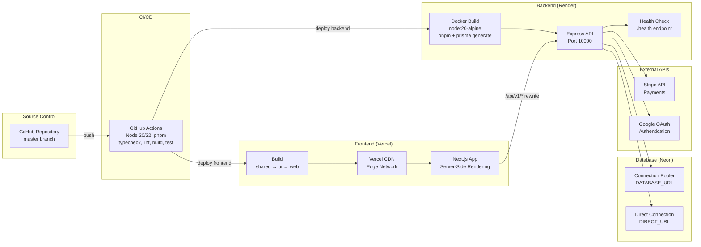

### 15.1 Deployment Configuration

**Vercel (Frontend)**
```json
{
  "installCommand": "pnpm install",
  "buildCommand": "pnpm --filter @saas/shared build && pnpm --filter @saas/ui build && pnpm --filter @saas/web build",
  "framework": "nextjs"
}
```

**Render (Backend)**
```yaml
services:
  - type: web
    name: brandcora-api
    runtime: docker
    plan: free
    branch: master
    dockerfilePath: apps/api/Dockerfile
    dockerContext: .
    healthCheckPath: /health
```

### 15.2 Docker Build (API)

```dockerfile
# Multi-stage build
# Stage 1: Build
FROM node:20-alpine AS builder
# Install pnpm, copy files, pnpm install, prisma generate, tsc build

# Stage 2: Production
FROM node:20-alpine
# Copy dist/, node_modules/, prisma/
# Run start.sh: prisma db push && node dist/index.js
```

### 15.3 CI Pipeline (`.github/workflows/ci.yml`)

- **Triggers:** Push to master, PRs
- **Matrix:** Node 20, 22
- **Steps:** Install pnpm → Install deps → TypeCheck → Lint → Build → Test
- **Services:** PostgreSQL (for integration tests)

---

## 16. Mermaid Diagrams

### 16.1 High-Level Architecture

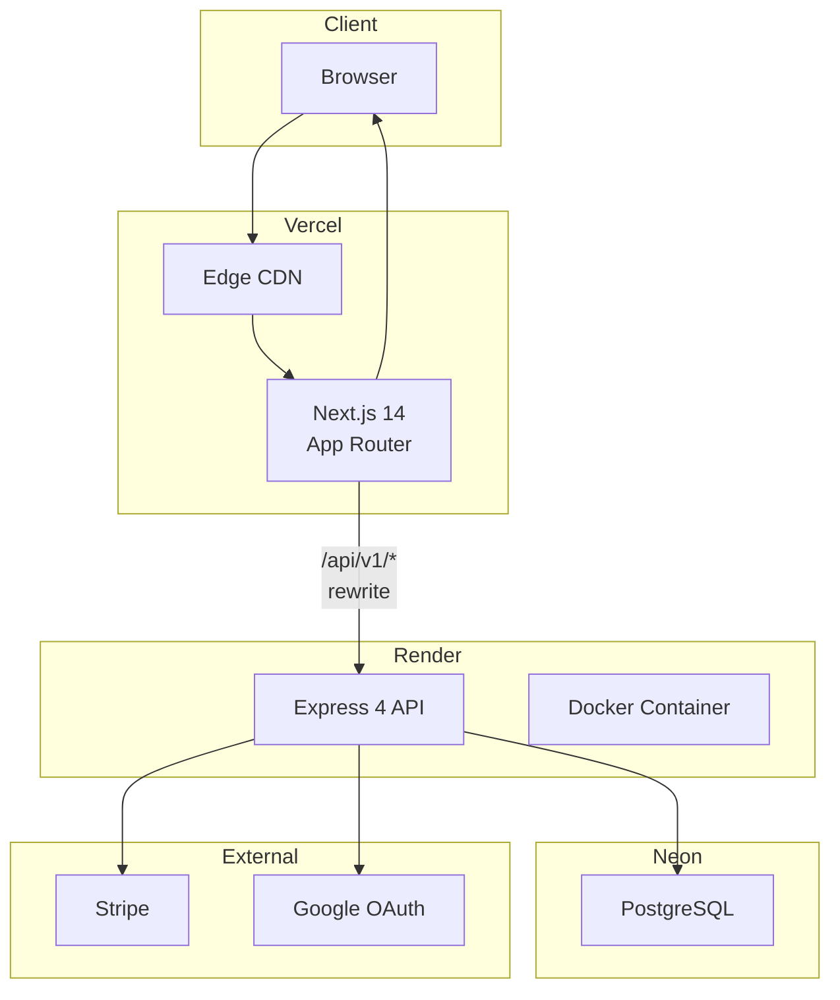

### 16.2 Authentication State Machine

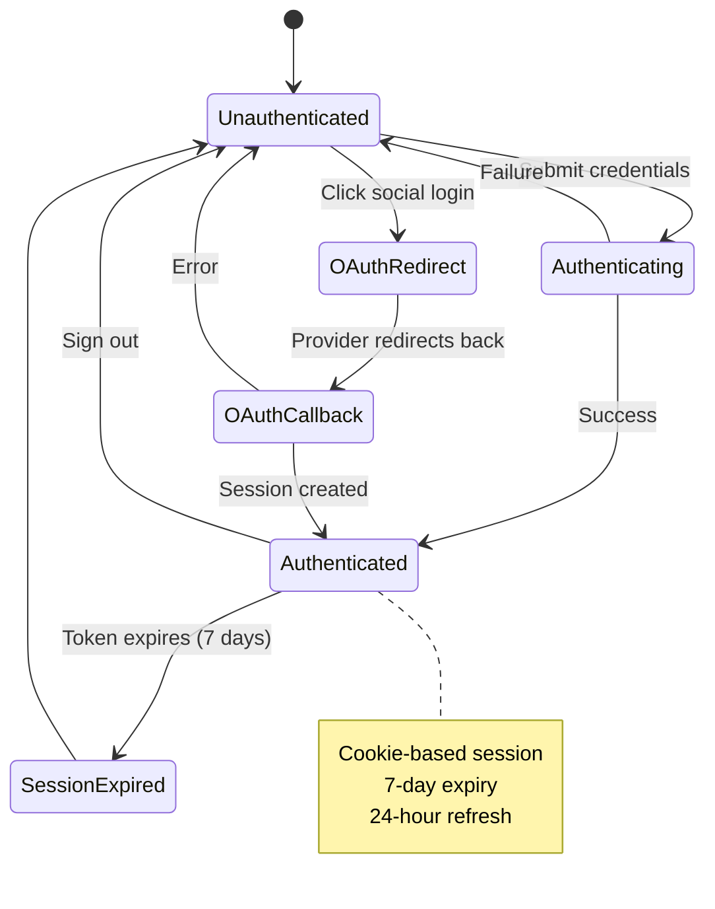

### 16.3 Request Flow

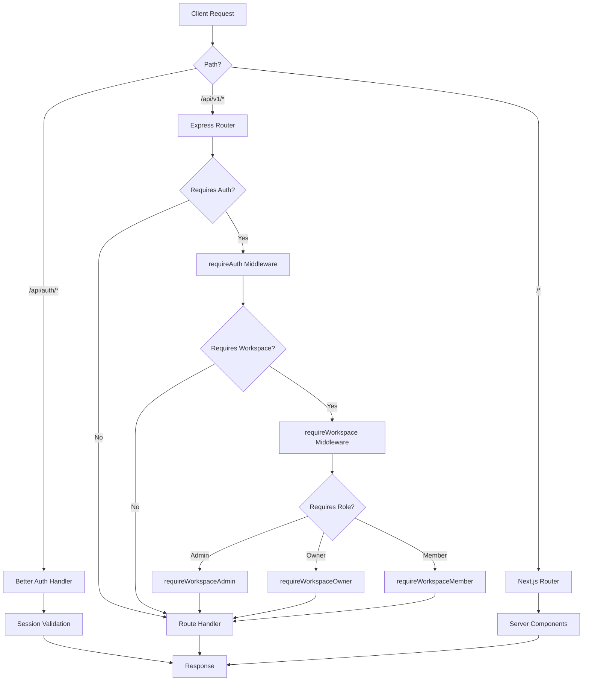

### 16.4 Brand Extraction Pipeline

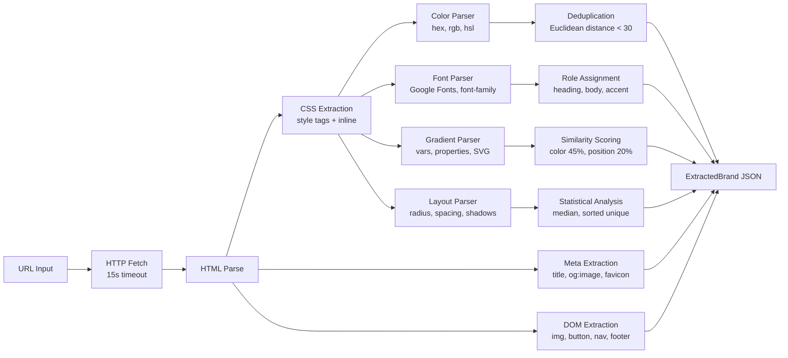

### 16.5 Stripe Payment Lifecycle

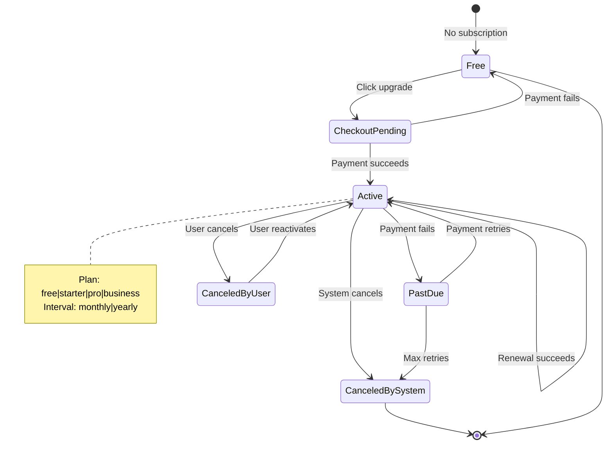

---

*Generated from source code analysis. Last updated: 2026-07-26*

